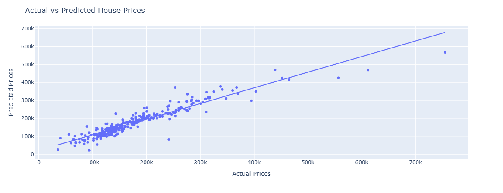
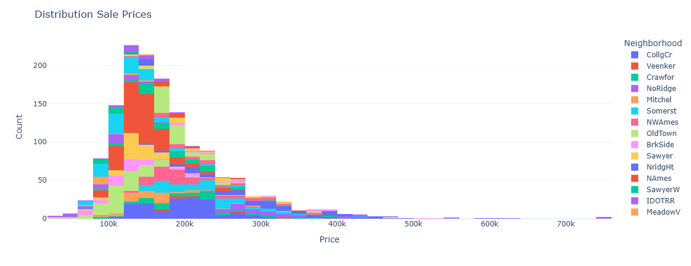
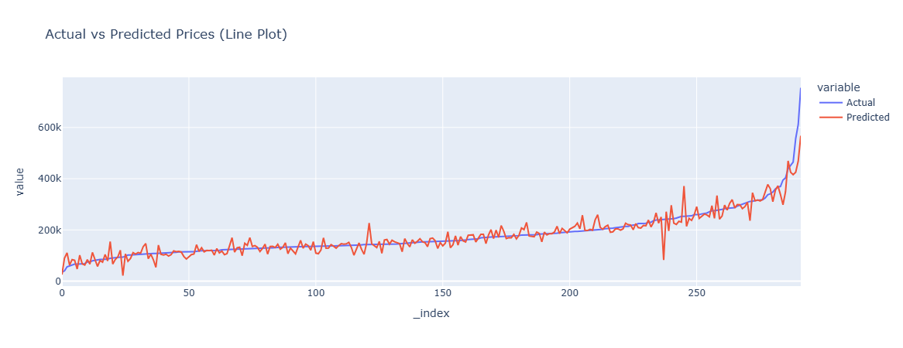
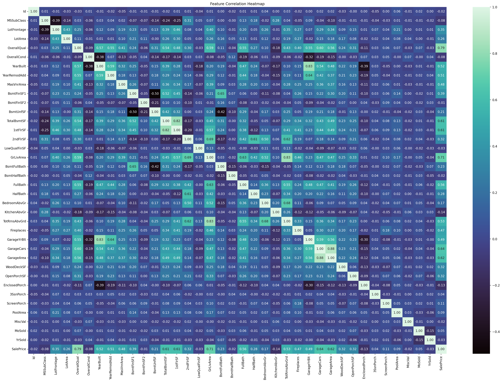
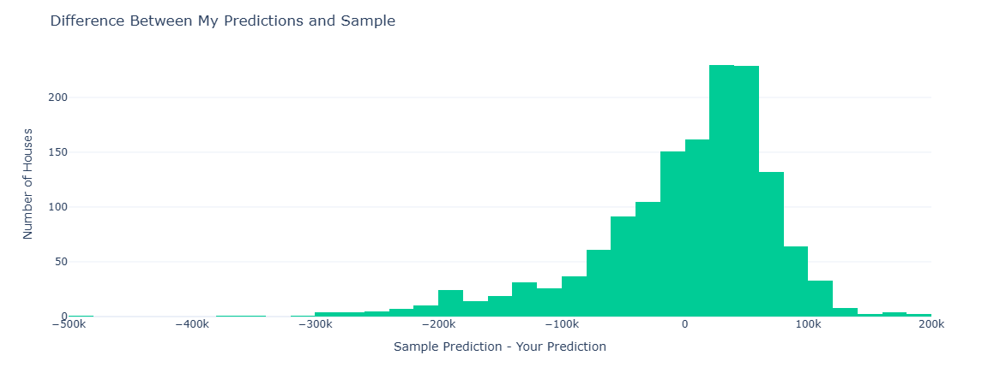
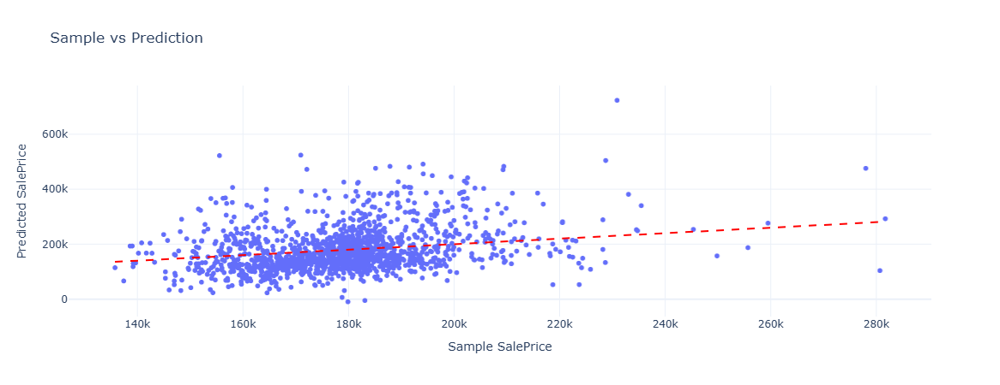

# 🏠 House Price Prediction

This project builds a linear regression model to predict house sale prices using the [Kaggle House Prices dataset](https://www.kaggle.com/c/house-prices-advanced-regression-techniques). It demonstrates a full machine learning pipeline — from preprocessing and feature engineering to model training, evaluation, and visualization.

---

## 🚀 How It Works

### 1. **Data Preprocessing**

-   Loaded training and test sets from CSV files.
-   Imputed:
    -   Numerical columns with the **median**
    -   Categorical columns with the **mode**
-   Converted categorical variables using **one-hot encoding**.

### 2. **Feature Engineering**

-   `TotalSF`: Total square footage (`1stFlr + 2ndFlr + Basement`)
-   `TotalBathRooms`: Combines full and half bathrooms
-   `Age`: Years since the house was built

### 3. **Modeling**

-   Built a Linear Regression model
-   Model is built with the help of `scikit-learn` library in `python`

### 4. **Evaluation**

-   Metrics on validation set:

    -   📉 **Mean Squared Error (MSE)**: `868842002.98`
    -   📏 **Root Mean Squared Error (RMSE)**: `29476.13`
    -   📈 **R<sup>2</sup> Score**: `0.8867`

---

## 📊 Visualizations

| Chart                   | Description                                                                 |
| ----------------------- | --------------------------------------------------------------------------- |
| 📈 Actual vs Predicted  | Compare true and predicted prices using `scatterplot` and `regression line` |
| 📊 Histogram            | Distribution of Sale Prices                                                 |
| 📈 Line chart           | Compare Actual vs Predicted house prices using `line plot`                  |
| 🧠 Correlation Heatmap  | Visualize the correlations between pairs of numerical features              |
| 📊 Histogram            | Difference of the actual and predicted values                               |
| 🔯 Sample vs Prediction | Compare sample prices given and our predicted prices                        |

---

## 📊 Visualization Examples

1.  Actual vs Predicted `scatterplot` with linear regression line

 <p align="center">
     
 </p>

2.  Distribution of sale prices partioned into `Neighborhood` with `histogram`

 <p align="center">
     
 </p>

3.  `Line Plot` for Actual and Predicted values

 <p align="center">
     
 </p>

4.  Correlation Heatmap of Numerical features

 <p align="center">
     
 </p>

5.  Difference of Sample predictions given and our predictions using `histogram`

 <p align="center">
     
 </p>

6.  Sample predictions given vs our predictions using `scatterplot` and regression line

 <p align="center">
     
 </p>

---

## 📤 Output

-   Final predictions stored in `house_price_pred.csv`
-   Format:

```sql
Id,SalePrice
1461,208500.0
1462,181500.0
```

---

## 🧪 Libraries Used

-   `pandas`, `numpy` – data manipulation
-   `scikit-learn` – preprocessing, model, metrics
-   `plotly`, `seaborn`, `matplotlib` – interactive charts

---

## 📦 Installation

```bash
pip install pandas numpy scikit-learn plotly statsmodels matplotlib seaborn
```

---

## 🤝 Credits

-   Dataset from [Kaggle House Prices](https://www.kaggle.com/c/house-prices-advanced-regression-techniques)

-   Author: [Koustav Chatterjee](https://github.com/Koustav2908)
